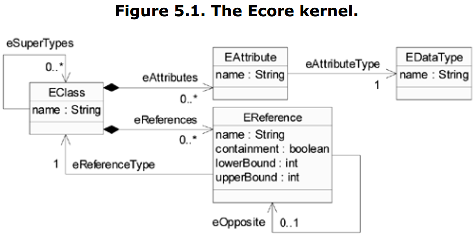
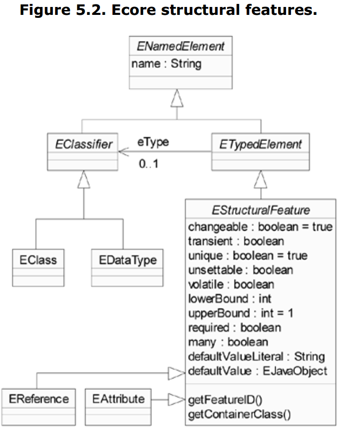

= 第五章 Ecore建模概念
:toc:
:toc-title: 目录

当我们创建一个核心模型，即是在定义一个模型实例的结构，无关乎此模型是直接创建，还是由Java、UML、XML创建。此过程也就是在定义组成模型实例、包含的数据、以及模型之间的关系的对象类型。例如前面章节提到的PrimerPO模型定义了购买订单的模型。在建模中定义这种模型为“元模型”。在某种意义上，元模型定义了一种使用模型实例来描述其他事物的语言。

> When we create a core model—whether directly or from annotated Java, UML, or XML Schema—we are defining the structure for a series of instances of that model. That is, we are specifying the types of objects that make up instance models, the data they contain, and the relationships between them. For example, the PrimerPO model of the previous chapter defined the structure for models that represent purchase orders. Modelers use the term "metamodel" for this kind of model. In a sense, metamodels define a language that their instance models use to describe other things.

如第二章提到，组成核心模型的元模型称为Ecore。即Ecore定义了核心模型的结构，核心模型定义了用来维护应用数据的模型结构，例如购买订单模型。因此Ecore是购买订单实例模型的元-元模型。

> As we first discussed in Chapter 2, the metamodel for core models is called Ecore. That is, Ecore defines the structure of core models, which in turn define the structure of the models we use to maintain application data, such as purchase orders. Thus, Ecore is the meta-metamodel for our purchase order instance models.

Ecore定义的大部分建模概念与面向对象相似。第二章提到，Ecore来源与MOF与UML中，并且设计上与Java实现对应。本质上如果你熟悉类以及类之间的关系，那么你对使用Ecore来定义核心模型也易于上手。

> Most of the modeling concepts that Ecore defines should be quite familiar to avid modelers and object-oriented programmers alike. As we discussed in Chapter 2, Ecore has its roots in MOF and UML, and was designed to map cleanly to Java implementations. Essentially, if you're comfortable thinking about classes and the relationships between them, you shouldn't have too much trouble using Ecore to define core models.

Ecore支持许多不直接包含在Java中的高级概念。例如核心模型支持包含关系、双向关系、以及枚举数据类型。你可能已经熟悉这些概念，或许已经多次实现这些概念。EMF的部分价值在于可以节省码畜的时间精力，直接生成正确高效的Java实现。

> Ecore supports a number of higher-level concepts that are not directly included in Java. For example, core models can include containment, bidirectional relationships, and enumeration data types. You are likely familiar with these concepts and have probably implemented them yourself more than once. Part of EMF's value is its ability to generate correct and efficient Java implementations for these constructs, saving the programmer time and effort.

Ecore本身也是一个核心模型。即Ecore本身作为自己的元模型，定义了自己。这表现了一些在概念与面向实现方面的挑战，但这并不是什么坏事。其他类似的模型作为元模型定义自己，或者其他非正式的过时方案，明显吸引力不足。此外我们认为Ecore与其他EMF模型一样，EMF生成器在创建与维护实现方面有一定优势。

> Ecore is, itself, a core model. That is, Ecore acts as its own metamodel, so it is defined in terms of itself. This presents a few conceptual and implementation-related challenges, but it's generally considered a good thing. The other alternatives—defining yet another model to acts as its metamodel or "hand-waving" through an informal definition—are significantly less attractive. Moreover, we are able to treat Ecore much like any other EMF model and to reap the benefits of the EMF generator in creating and maintaining its implementation.

我们将在此章节中详细讨论Ecore，使你在定义核心模型时能得心应手。把Ecore作为自身元模型的方式有一个明显需要讨论的方面，即某些模型元素是用于描述其他模型元素的。因此我们从一个简单的模型子集开始入手。在全面了解这个子集后，就可以此基础上对Ecore进行完整详细的学习。

> In this chapter, we will examine Ecore in detail, with the aim of enabling you to use it effectively in defining your own core models. The use of Ecore as its own metamodel inevitably influences such a discussion, as aspects of certain model elements will be described in terms of other model elements. Thus, we begin the discussion with a simplified subset of the model that you may recognize from Chapter 2. Once we understand that subset in its entirety, we can build on that understanding a complete description of the details of Ecore.

== 5.1 核心模型使用 Core Model Uses

在深入了解Ecore之前，需要先了解EMF如何使用核心模型。跟其他EMF模型一样，核心模型可以用编码方式构建，或以多种形式加载。常见有两种不同使用场景：在应用开发过程中，与在应用运行中。

> Before delving into the discussion of Ecore, a word about how EMF uses core models would be appropriate. Like any other model in EMF, a core model can be built programmatically or loaded from a serialized form. It is generally used in two different contexts: during application development and when the application is running.

核心模型在开发中是EMF生成器的信息主要来源，

> During development, the core model is the primary source of information for the EMF generator, when it produces code to be used in the application. As we discussed in Chapter 2, this code includes the interfaces and classes that realize the modeled types, a factory for instantiating them, and a package that efficiently builds the core model at runtime and provides convenient access to its members. The EMF generator reads core models from their XMI serializations.

> At runtime, the core model is used by generic framework code to determine correct behavior for that particular model, and is likewise available to user-written code that needs to dynamically discover particulars of the model. The framework code that depends upon the core model handles not only such peripheral functionality as serialization, but also includes some of the basic Ecore functionality expressed in the EObject API. In fact, in the absence of generated code, the behavior of all dynamic model objects is completely dependent on a core model. At runtime, the core model can either be built programmatically or loaded from a serialization; however, the former, more efficient approach is always taken for generated models.

> In discussing the details of Ecore, we will see that most of the concepts that it defines are equally applicable in both the code generation and runtime contexts. Some, however, have special significance in one context or the other, which we will point out as appropriate.

== 5.2 Ecore内核 The Ecore Kernel

在2.3.1章节中，我们展示了Ecore模型的一个简化子集，我们称之为Ecore内核，并基于此来展开关于完整模型的讨论。核心模型如图5.1所示。

> In Section 2.3.1, we presented an illustration of a simplified subset of the Ecore model. We describe this, with minor additions, as the Ecore kernel, and we will use it to "bootstrap"[1] the discussion of the full model. This model is illustrated in Figure 5.1.

注意此处的内核只是为了讨论目的，关于这些元素是如何定义以及如何在Ecore实现中创建，也没有什么特别的。

> Note that we have created this kernel only for the purposes of this discussion. There is nothing particularly special about how these elements are defined or created in the implementation of Ecore.

回顾第二章，本质上核心模型定义了4个对象类型，即4个类：

> Essentially, reviewing from Chapter 2, this model defines four types of objects—that is, four classes:

 . *EClass* 表示类本身。一个类由名称区分，并且包含若干个属性attributes和引用references。为了支持继承关系，一个类可以是多个类的超类型
 . *EAttribute* 表示组成一个对象数据的属性。同样由名称区分，并对应一个数据类型。
 . *EDataType* 表示属性的类型，即Java中（非EMF）定义的原始数据类型。数据类型同样由名称区分。
 . *EReference* 表示类与类之间的关系，但只表示此关系中的单端。与属性一样，引用由名称区分，并对应一个类型。此类型的对应的另一端需为 *EClass*。如果此关系反向也成立，则另一个类中也有对应的引用关系。引用也指定了其多重性的上下界。引用也用于表示一种关系的强类型，即包含；引用也指定了是否强制包含的语义。

> . *EClass* models classes themselves. Classes are identified by name and can contain a number of attributes and references. To support inheritance, a class can refer to a number of other classes as its supertypes.
. *EAttribute* models attributes, the components of an object's data. They are identified by name, and they have a type.
. *EDataType* models the types of attributes, representing primitive and object data types that are defined in Java, but not in EMF. Data types are also identified by name.
. *EReference* is used in modeling associations between classes; it models one end of such an association. Like attributes, references are identified by name and have a type. However, this type must be the *EClass* at the other end of the association. If the association is navigable in the opposite direction, there will be another corresponding reference. A reference specifies lower and upper bounds on its multiplicity. Finally, a reference can be used to represent a stronger type of association, called containment; the reference specifies whether to enforce containment semantics.

注意此模型是一个整体，它可以自己引用自己。当我们描述EClass时，用EAttribute来描述属性，用EReference描述引用，甚至间接引用一个EReference的属性。但此概念与常规建模和面向对象都很相似，当我们理解了Ecore的这个子集后，就可以继续学习模型的其他部分了。

> Notice that this model really needs to be understood as a single unit, as it is highly self-referential.In describing EClass, we described its attributes, which are modeled using EAttribute, and its references, modeled with EReference, even referring indirectly to the attributes of EReference. Fortunately, the concepts expressed in this model should be quite familiar to modelers and objectoriented programmers, so this probably wasn't too troublesome. Now, with this subset of Ecore in hand, we can tackle the rest of the model.

== 5.3 结构特性 Structural Features

回顾Ecore内核，会发现 *EAttribute* 和 *EReference* 有许多相似之处：都具有名称和类型，都定义了所属 *EClass* 一个实例的状态。这两个类其实还有许多共同点，例如之前我们在 *EReference* 中展示的 *lowerBound* 和 *upperBound* 属性。Ecore提供了一个基类来封装这些相似点，即 *EStructuralFeature* 。其关系如图5.2所示。

> Looking back at the Ecore kernel, you may notice a number of similarities between *EAttribute* and *EReference*: they both have names and types, and taken together, they define the state of an instance of the *EClass* that contains them. There are many more common aspects of these two classes, including, in fact, the *lowerBound* and *upperBound* attributes, which we previously showed only for *EReference*. To capture these similarities, Ecore includes a common base for these two classes, called *EStructuralFeature*. The situation is illustrated in Figure 5.2.

如图所示，*EStructuralFeature* 继承自其他超类。*ENamedElement* 仅定义了一个属性，即我们之前在每个类都已经见到的 *name*。绝大部分Ecore类都扩展自此类，以继承这个属性。

> As the figure shows, *EStructuralFeature* is, itself, derived from other supertypes. *ENamedElement* defines just one attribute, the *name* that we have seen in every class discussed so far. Most classes in Ecore extend this class in order to inherit this attribute.

另一个 *EAttribute* 与 *EReference* 的共同之处是都有一个类型的概念。因为在Ecore中也有其他类具有类型概念，所以 *eType* 属性被纳入到 *EStructuralFeature* 的直属父类 *ETypedElement* 中。注意 *eType* 的类型是 *EClassifier*，此类是 *EDataType* 和 *EClass* 的公共基类，对应是 *eAttrbituteType* 和 *eFeatureType* 的类型。

> Another common aspect of *EAttribute* and *EReference* that we observed is the notion of a type. Because this is also shared with other classes in Ecore, as we will soon see, the *eType* attribute is factored out into *ETypedElement*, the immediate supertype of *EStructuralFeature*. Notice that the type of *eType* is *EClassifier*, a common base class of *EDataType* and *EClass*, which were the required types for *eAttrbituteType* and *eFeatureType*, respectively.

*EStructuralFeature* 包含一系列描述属性与引用的属性。以下5个属性定义了结构特性是如何存储与访问值的：

> *EStructuralFeature* includes a number of attributes used to characterize both attributes and references. Five boolean attributes define how the structural feature stores and accesses values:

. *changeable* 表示是否可从外部设置此值
. *transient* 表示此属性是否参与所属对象的序列化
. *unique* 仅对大量的属性有意义，表示一个值只允许在此属性中出现不超过一次
. *unsettable* 表示此属性是否有额外可能的值，
. *volatile* 表示此属性无强关联，一般场景是此属性的值是由其他特性直接传递而来。这类特性在Java中需要编码来实现访问。

> . *changeable* determines whether the value of the feature may be externally set.
. *transient* determines whether the feature is omitted from the serialization of the object to which it belongs.
. *unique*, which is only meaningful for multiplicity-many features, specifies whether a single value is prevented from occurring more than once in the feature.
. *unsettable* specifies whether the feature has an additional possible value, called unset, that is unique from any of its type's legal values, including `null` for an object type. The value of this attribute also determines the semantics of `EObject`'s `eUnset()` and `eIsSet()` reflective APIs: these methods change an unsettable feature's value to that unset value and test whether it is set to some other value, respectively. But, for a non-unsettable feature, they reset the feature's value to its default and test that it is set to a non-default value, respectively.
. *volatile* specifies whether the feature has no storage directly associated with it; this is generally the case when the feature's value is derived purely from the values of other features. The bodies of the accessors for such features must be coded by hand in Java.

> Before continuing, it is worth enlarging slightly on the notion of structural features whose values are derived from those of other features. Since we declare such features as volatile, they contribute nothing to the state of an object and, accordingly, they have nothing to offer to the serialized form. Hence, we usually declare them to be transient, as well. Moreover, to keep things simple, we generally do not want their values to be externally set, so we also declare them to be nonchangeable. In fact, throughout this discussion of Ecore, we will use the term derived to imply that a structural feature is volatile, transient, and non-changeable. Keep in mind that you are never responsible for determining appropriate values for derived structural features; we describe them only so you can use them to programmatically inspect a core model.